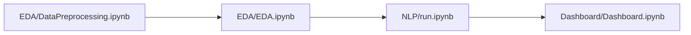

# Aspect-based Sentiment Analysis on Cosmetics Customer Reviews
2023-2 자연언어처리 프로젝트

## Result


## Dataset
[AI-Hub 속성기반 감성분석 데이터](https://www.aihub.or.kr/aihubdata/data/view.do?currMenu=&topMenu=&aihubDataSe=realm&dataSetSn=71603)를 사용했습니다.

## Model
[klue/roberta-base](https://huggingface.co/klue/roberta-base)를 사용했습니다.

## Summary
|Directory|Explanation|
|:--:|:--:|
|EDA|데이터 전처리를 수행하는 `DataPreprocessing.ipynb`, 간단히 데이터 확인하는 `EDA.ipynb`|
|NLP|기타 기능을 분리한 `etc_plugin.py`, 모델 관련 부차적 함수를 분리한 `model_plugin.py`, 모델 학습하는 `run.ipynb`|
|Dashboard|생성된 BEST 모델을 기반으로 test 데이터셋을 넣었을 때 점수를 확인하고, 대시보드용 csv 파일을 생성하는 `Dashboard.ipynb`|

## Usage

### Python 3.8.10

```bash
python -m venv myenv &&
source myenv/bin/activate &&
pip install -r requirements.txt &&
jupyter notebook
```

### Execution Order

> [!Important]
> [EDA/absa_data](./EDA/absa_data/labeling_data/)안에 AI-Hub 속성기반 감성분석 데이터(도메인이 '화장품'인 데이터만 해당)를 넣고 아래와 같은 순서로 실행해주세요.


